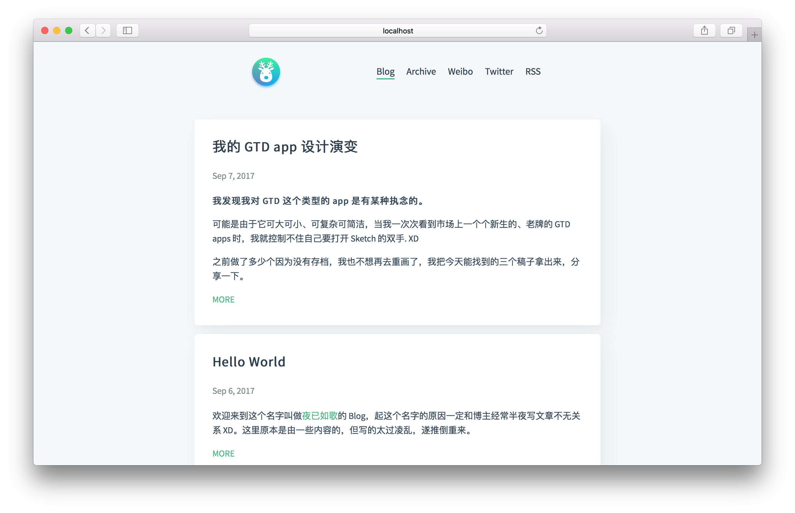

<p align="center">
    
</p> 



## README

### [请先浏览原项目README Please read the origon README first](https://github.com/pinggod/hexo-theme-apollo/README.md)  

- 这个项目修改自 [Hexo Apollo 主题](https://github.com/pinggod/hexo-theme-apollo)
- 修改为卡片风格
- 增加点击后加载 Disqus 功能
  
- This project is modified from [Hexo Theme Apollo](https://github.com/pinggod/hexo-theme-apollo)
- Modify to card stye
- Add the load the Disqus after click function


## 贡献 Contribute

该项目欢迎 pull request。
You're welcome to pull request.

## 安装 Install

``` bash
hexo init Blog 
cd Blog 
npm install
npm install --save hexo-renderer-jade hexo-generator-feed hexo-generator-sitemap hexo-browsersync hexo-generator-archive
git clone https://github.com/NobelLiu/hexo-theme-apollo-card.git themes/apollo-card
```

## 启用 Enable

修改 `_config.yml` 的 `theme` 配置项为 `apollo-card`:

```yaml
theme: apollo-card

## 更新 Update

``` bash
cd themes/apollo-card 
git pull
```

## License

MIT
